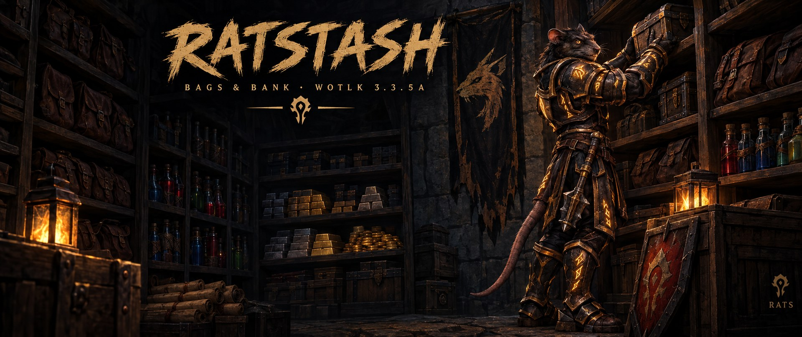
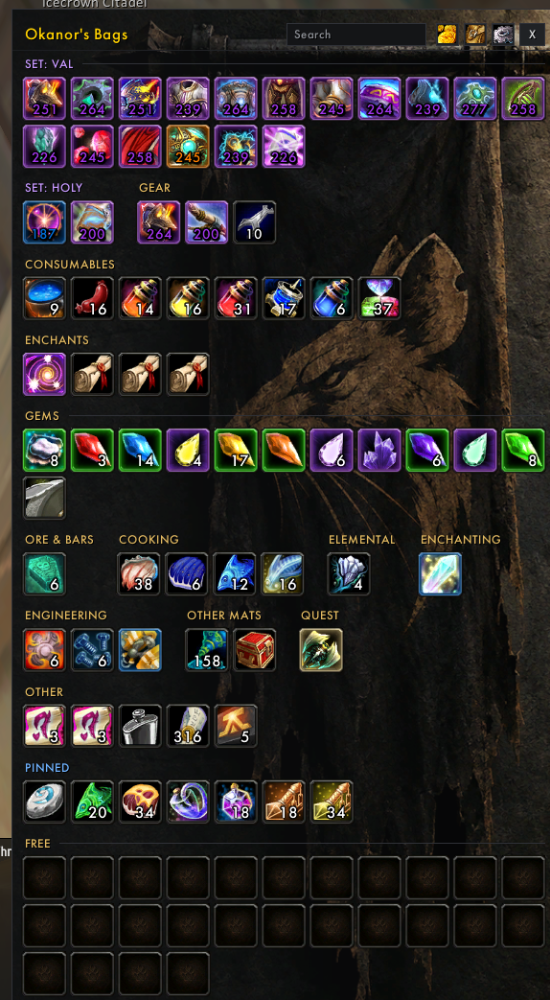
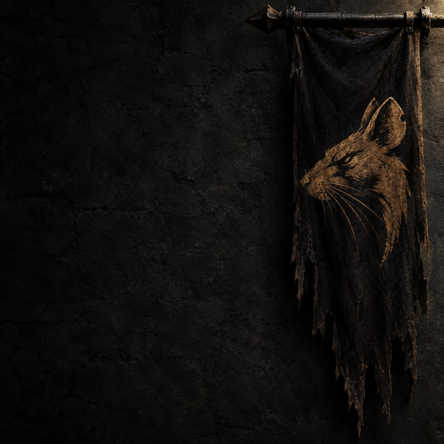
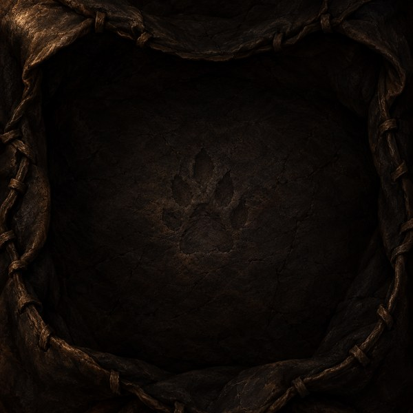

  

  <b>Bags and bank for World of Warcraft 3.3.5a.</b> 
  Bagnon's single window, AdiBags' sorting, and a fixed order so nothing jumps around.

  
  
  
  
  

---

<table>
<tr>
<td width="45%" valign="top">
  
</td>
<td valign="top">

### Why another bag addon

AdiBags sorts well, but its groups move around: a free-space block lands in the middle, your sets
end up far apart, and the loot you picked up for the raid disappears into your own stacks.

RatStash keeps what's good about it and makes the rest predictable:

- **Everything has a fixed place.** Pinned items, then your sets, then consumables, enchanting,
  gems, ore, herbs… and gear at the end.
- **Your Hearthstone is pinned from the start** and always leads the pinned items.
- **Raid loot never mixes with yours.** Loot one Primordial Saronite in a PuG and it shows apart from
  your own six, glowing green, until you say it's yours.
- **Nothing reshuffles under your mouse**, so you can sell or move items one after another.

</td>
</tr>
</table>

## Features

| | |
|---|---|
| **Automatic sorting** | Items are only *drawn* in order; nothing moves inside your real bags, so it works in combat. Turn it off to see your bags exactly as they are, like Bagnon. |
| **Three layouts** | Per window: one grid · one grid plus a group per gear set · a block per kind (the bank defaults to blocks). Small blocks share a row and fill the gaps. |
| **Pinned items** | Alt-click any item to pin it, at the top or the bottom. The Hearthstone always comes first. |
| **Gear sets** | Pieces of each Equipment Manager set are grouped, in slot order. |
| **Raid loot** | Loot from a raid glows green and shows its trade timer. As master looter it gets its own group; with [Okanvil](https://github.com/MrNog/Okanvil), reserved loot (hard reserves, reserved BoE / Orb / Pattern / Frag) goes to **[HR] Reserved**. |
| **Item badges** | Item level on gear in its quality color, and a **BoE** tag. |
| **Virtual stacks** | Identical items and full stacks shown as one slot. At a vendor, bank, mailbox or trade, identical gear splits back into one slot each so you can sell just one. |
| **Stack to bank** | One click at the bank moves stackable items you already keep there onto their bank stacks. |
| **Offline bank** | Browse your bank from anywhere. |
| **Bag bar** | See your bag slots, drag a new bag onto one to swap it, buy bank slots. |
| **Look** | Flat dark windows in the Okanvil style, the guild's banner behind your items, settings in their own window. Settings are account-wide. |

## Artwork

Painted for RatStash in the RATS guild style: the war banner that hangs behind your items, and the
leather pouch every empty slot shows. Turn the banner off or down in the settings.

  
  &nbsp;
  

## Install

1. Download the latest release, or the repository as a zip.
2. Put the folder in `World of Warcraft\Interface\AddOns\` and name it **`RatStash`**.
3. Turn off other bag addons (AdiBags, Bagnon, ArkInventory…) so they don't fight over your bags.
4. Restart the game.

## Use

| | |
|---|---|
| `B` or the backpack button | open your bags |
| `/rst` · `/ratstash` | toggle your bags |
| `/rst bank` | open your bank, even away from it |
| `/rst options` | settings |
| `/rst keep` | treat all raid loot as your own |
| **Alt-click** an item | pin or unpin it |

## Credits

Made by **Okanor** for the RATS guild.
Built on ideas from [Bagnon](https://github.com/Jaliborc/Bagnon) (the single window and the bank view)
and [AdiBags](https://github.com/AdiAddons/AdiBags) (sorting and virtual stacks).

## License

© 2026 Okanor. All rights reserved. Everyone is welcome to read the code, download RatStash and play
with it. Want to change something? Send a pull request — see [CONTRIBUTING](CONTRIBUTING.md).
Publishing your own modified version or re-uploading it elsewhere needs the author's permission —
see [LICENSE](LICENSE).
